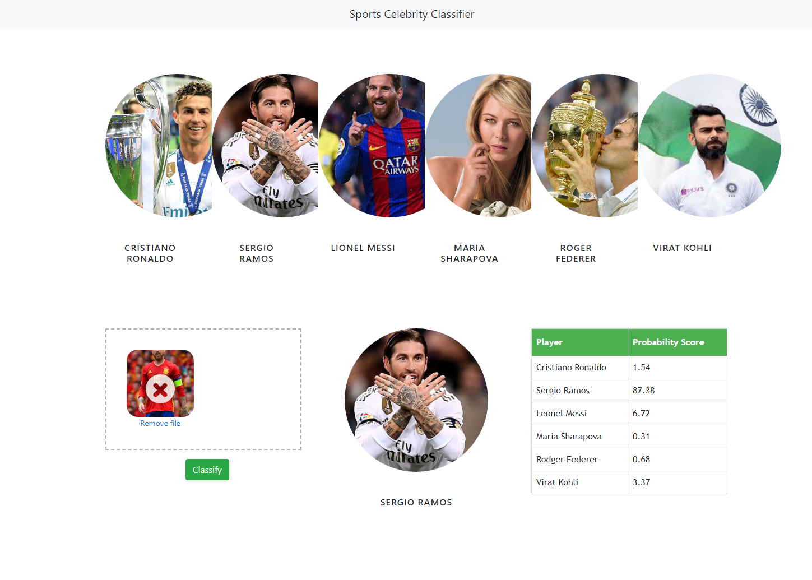
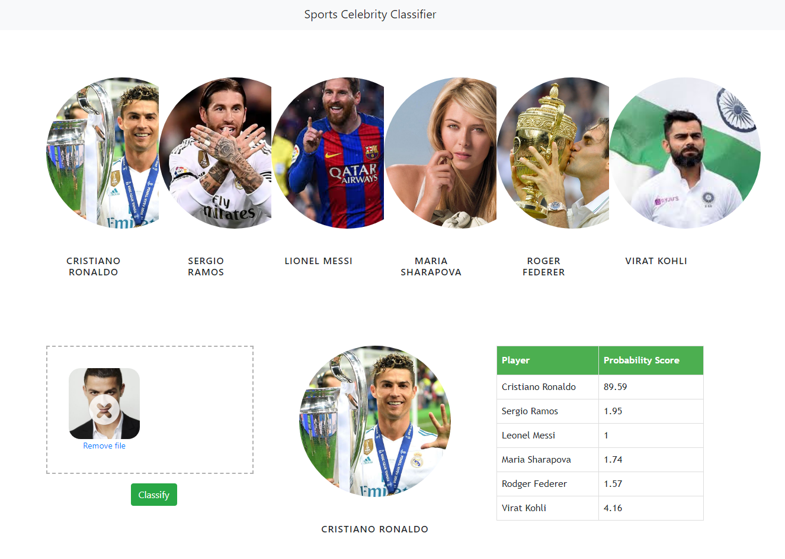

# Celebrity Face Recognition Project(Overview)

## Website UI

* Created a tool that predicts famous celebrities from a scraped dataset images with 78% accuracy.

* Scraped over 1000 images from Google photos using python and selenium.

* Engineered features from the images of every Celebrity to identify face and eyes and cropped the perfect portion by   using OpenCV(Haarcascades) and Wavelet.

* Optimized SVM, Random Forest, and Logistic Regression using GridsearchCV to reach the best model.

* Built a client facing UI using JavaScript, HTML and CSS.

* Built a client facing API using flask.

In this Data science and Machine learning project, we classify sports personalities. We restrict classification to only 6 people,
1) Cristiano Ronaldo
2) Maria Sharapova 
3) Virat Kohli
4) Roger Federer
5) Sergio Ramos
6) Lionel Messi

**Here is the folder structure:**
* UI : This contains ui website code 
* server: Python flask server
* model: Contains python notebook for model building
* google_image_scrapping: code to scrap google for images
* images_dataset: Dataset used for our model training

**Technologies used in this project:**
1. Python
2. Numpy and OpenCV for data cleaning
3. Matplotlib & Seaborn for data visualization
4. Sklearn for model building
5. Jupyter notebook, visual studio code and pycharm as IDE
6. Python flask for http server
7. HTML/CSS/Javascript for UI

## Sources

**Image Scrapper Code:** https://towardsdatascience.com/image-scraping-with-python-a96feda8af2d

**Image Scrapper Code:** https://medium.com/@wwwanandsuresh/web-scraping-images-from-google-9084545808a2

**You can view on the details of this project here:** https://www.youtube.com/channel/UCh9nVJoWXmFb7sLApWGcLPQ
